# WebRTC-Lite Architecture

## 목차

- [시스템 개요](#시스템-개요)
- [아키텍처 원칙](#아키텍처-원칙)
- [시스템 구성 요소](#시스템-구성-요소)
- [데이터 흐름](#데이터-흐름)
- [보안 아키텍처](#보안-아키텍처)
- [확장성 전략](#확장성-전략)
- [기술 스택](#기술-스택)

---

## 시스템 개요

WebRTC-Lite는 비용 효율적인 하이브리드 WebRTC 인프라 솔루션으로, Firebase Firestore의 시그널링과 Oracle Cloud Free Tier의 TURN/STUN 서버를 결합하여 월 $0 비용으로 실시간 통신을 제공합니다.

### 핵심 목표

1. **비용 효율성**: Oracle Cloud Free Tier와 Firebase Free Tier 활용
2. **간단한 배포**: 자동화 스크립트로 10분 내 구축 가능
3. **크로스 플랫폼**: Android와 iOS 지원
4. **보안**: HMAC-SHA1 기반 동적 자격 증명 및 Firestore 보안 규칙

---

## 아키텍처 원칙

### 1. 비용 최적화 (Cost Optimization)

- Oracle Cloud Free Tier 활용 (월 10TB 트래픽)
- Firebase Free Tier 활용 (일일 50K 읽기, 20K 쓰기)
- 트래픽 패턴에 따른 자동 리소스 조정

### 2. 단순성 (Simplicity)

- 관리형 서비스 최대 활용 (Firebase)
- 최소한의 자체 인프라 (Coturn만 자체 호스팅)
- 선언적 구성 (Terraform)

### 3. 보안 (Security)

- 시간 기반 자격 증명 (TTL: 60-86400초)
- Firestore 보안 규칙으로 참여자만 접근
- TLS 1.3 암호화

### 4. 확장성 (Scalability)

- 무료 티어에서 유료 티어로 원활한 전환
- 상태 비저장 API 설계
- 수평적 확장 가능

---

## 시스템 구성 요소

### C4 Context Diagram

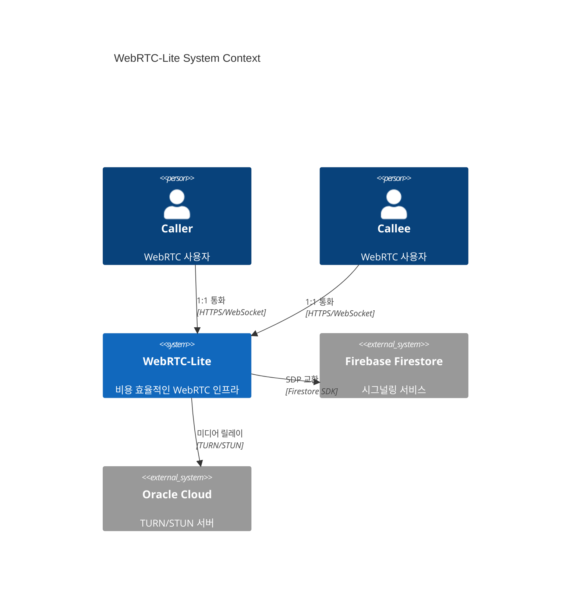

### C4 Container Diagram

```mermaid
C4Container
    title WebRTC-Lite Container Diagram

    Person(user, "모바일 사용자")

    Container(client_android, "Android Client", "Kotlin", "WebRTC 클라이언트 앱")
    Container(client_ios, "iOS Client", "Swift", "WebRTC 클라이언트 앱")

    ContainerDb(firestore, "Firebase Firestore", "NoSQL Document DB", "시그널링 데이터 저장")
    Container(turn_api, "TURN Credentials API", "FastAPI", "TURN 자격 증명 발급")
    Container(turn_server, "Coturn TURN Server", "C/Ubuntu", "미디어 릴레이")

    Container_Monitoring(prometheus, "Prometheus", "Metrics Collection")

    Rel(user, client_android, "사용")
    Rel(user, client_ios, "사용")

    Rel(client_android, firestore, "시그널링 (Offer/Answer/ICE)")
    Rel(client_ios, firestore, "시그널링 (Offer/Answer/ICE)")

    Rel(client_android, turn_api, "자격 증명 요청", "REST")
    Rel(client_ios, turn_api, "자격 증명 요청", "REST")

    Rel(turn_api, turn_server, "자격 증명 생성", "HMAC-SHA1")

    Rel(client_android, turn_server, "미디어 릴레이", "TURN/STUN")
    Rel(client_ios, turn_server, "미디어 릴레이", "TURN/STUN")

    Rel(turn_server, prometheus, "메트릭 전송")
```

### Coturn TURN Server 상세

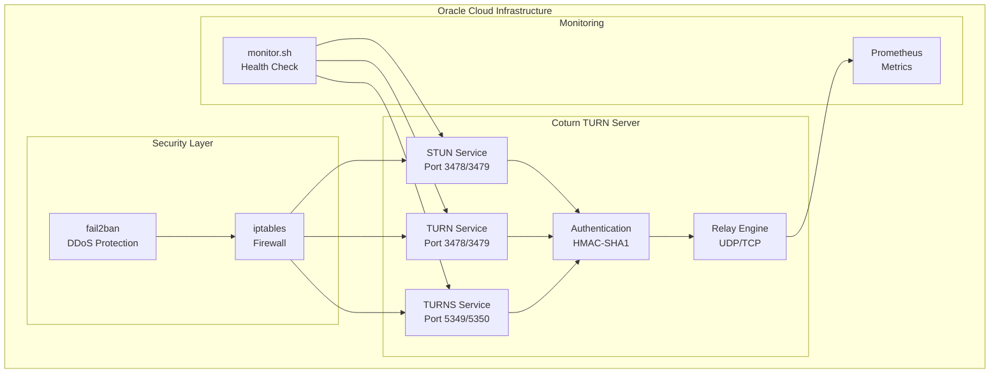

### Firebase Firestore 구조

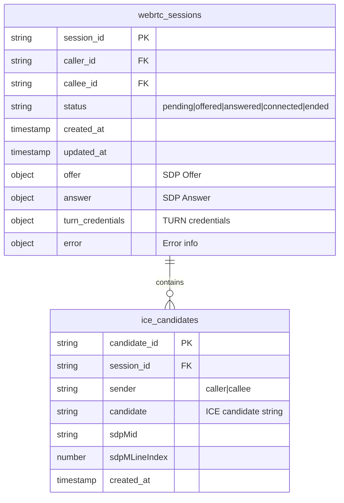

---

## 데이터 흐름

### WebRTC 통화 연결 시퀀스

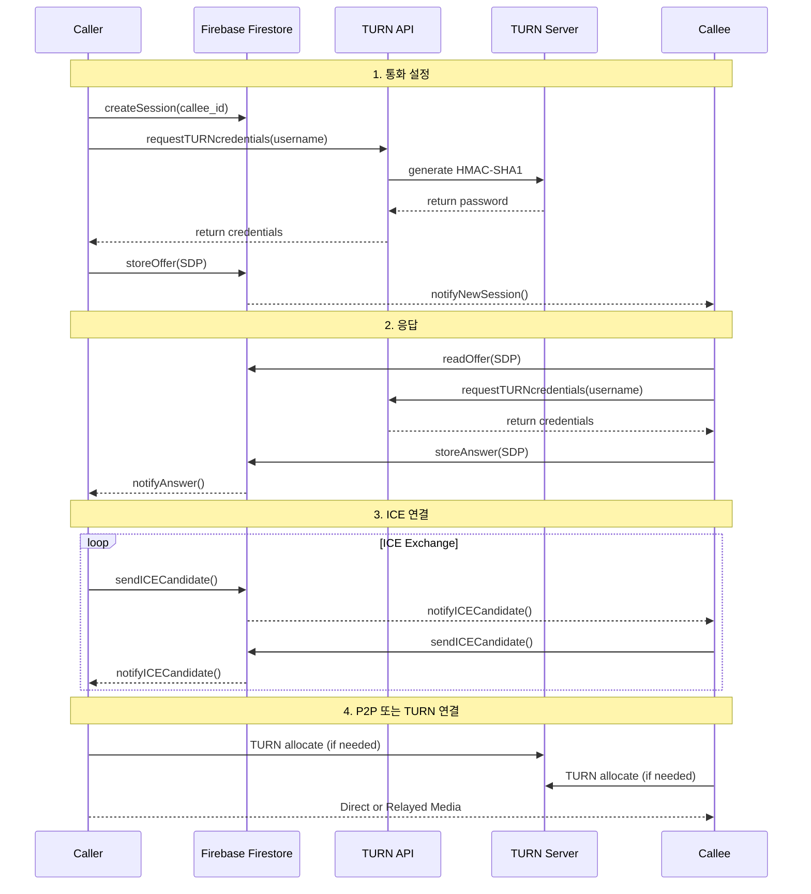

### TURN 자격 증명 발급 흐름

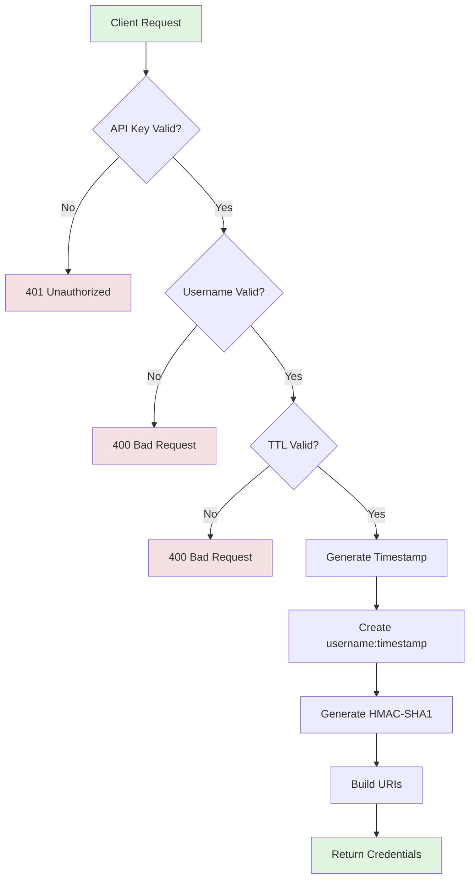

### 시그널링 데이터 흐름

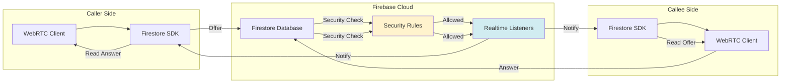

---

## 보안 아키텍처

### 보안 레이어

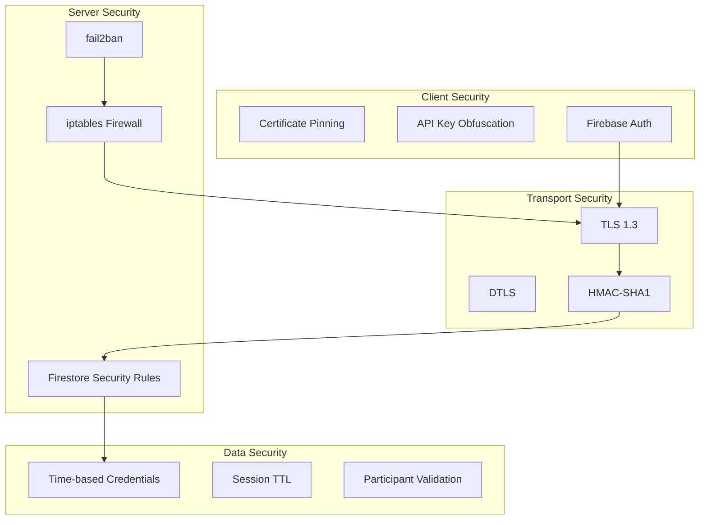

### Firestore 보안 규칙 구조

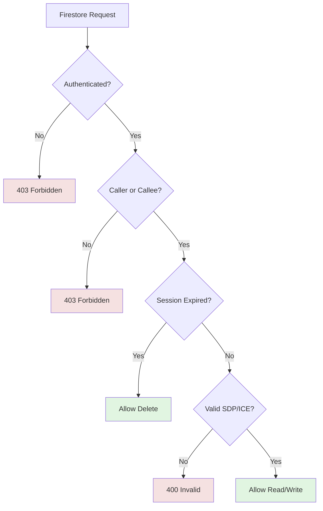

---

## 확장성 전략

### 수평적 확장 (Horizontal Scaling)

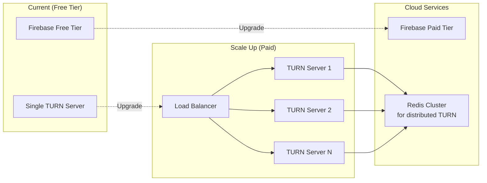

### 비용 최적화 경로

1. **Free Tier (0-100 concurrent users)**
   - Oracle Cloud Free Tier: 1 VM, 10TB bandwidth
   - Firebase Free Tier: 50K reads/day

2. **Growth Tier (100-500 concurrent users)**
   - Oracle Cloud Paid: 2-3 VMs with Load Balancer
   - Firebase Paid Tier: Blaze plan
   - 예상 비용: ~$50-100/월

3. **Production Tier (500+ concurrent users)**
   - Oracle Cloud: 5+ VMs, Auto Scaling
   - Cloudflare for CDN/DDoS protection
   - 예상 비용: ~$200-500/월

---

## 기술 스택

### 인프라 계층

| 컴포넌트 | 기술 | 버전 | 용도 |
|---------|------|------|------|
| Cloud Provider | Oracle Cloud | - | TURN/STUN 서버 호스팅 |
| VM Shape | VM.Standard.E2.1.Micro | - | Free Tier (1 OCPU, 1GB RAM) |
| IaC Tool | Terraform | ~> 5.0 | 인프라 자동화 |
| OS | Ubuntu | 22.04 LTS | 운영 체제 |

### TURN/STUN 계층

| 컴포넌트 | 기술 | 버전 | 용도 |
|---------|------|------|------|
| TURN Server | Coturn | 4.6+ | STUN/TURN 서비스 |
| Authentication | HMAC-SHA1 | - | 시간 기반 자격 증명 |
| TLS Certificate | Let's Encrypt | - | TLS 1.3 암호화 |

### API 계층

| 컴포넌트 | 기술 | 버전 | 용도 |
|---------|------|------|------|
| Web Framework | FastAPI | 0.104+ | REST API |
| Python | Python | 3.12+ | 런타임 |
| ASGI Server | Uvicorn | 0.24+ | API 서버 |

### 시그널링 계층

| 컴포넌트 | 기술 | 버전 | 용도 |
|---------|------|------|------|
| Database | Firebase Firestore | - | 시그널링 데이터 저장 |
| Security | Firestore Security Rules | v2 | 데이터 접근 제어 |
| Indexes | Firestore Indexes | - | 쿼리 최적화 |

### 클라이언트 계층

| 플랫폼 | 언어 | WebRTC 라이브러리 | 상태 |
|--------|------|------------------|------|
| Android | Kotlin | Google WebRTC (1.0+) | ✅ 완료 |
| iOS | Swift | Google WebRTC (1.0+) | 🔄 진행 중 |

---

## Android Client Architecture (Milestone 2)

### Clean Architecture 계층 구조

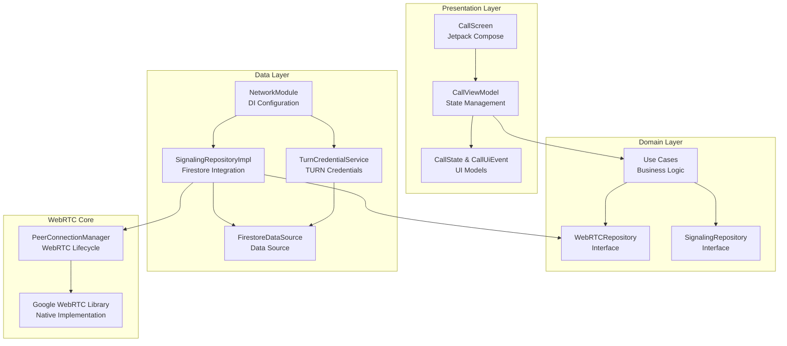

### Android 컴포넌트 상세

#### Presentation Layer
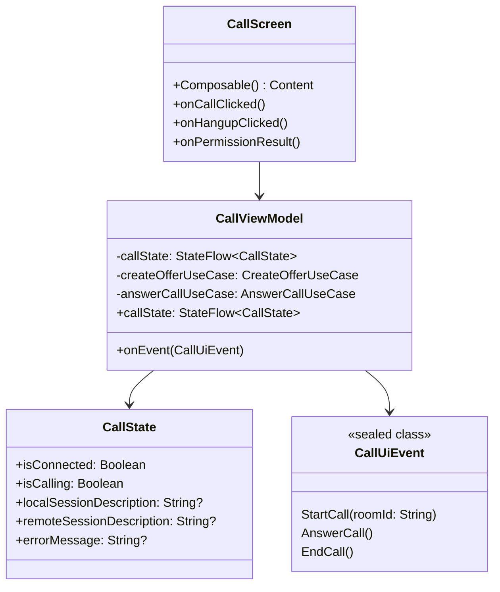

#### Domain Layer
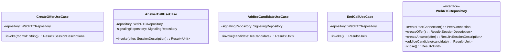

#### Data Layer
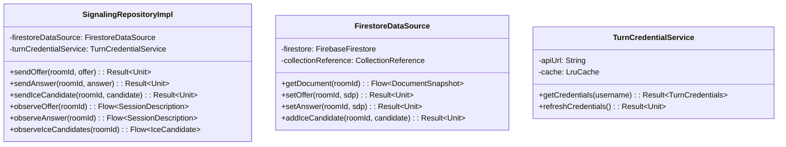

### WebRTC PeerConnection 관리

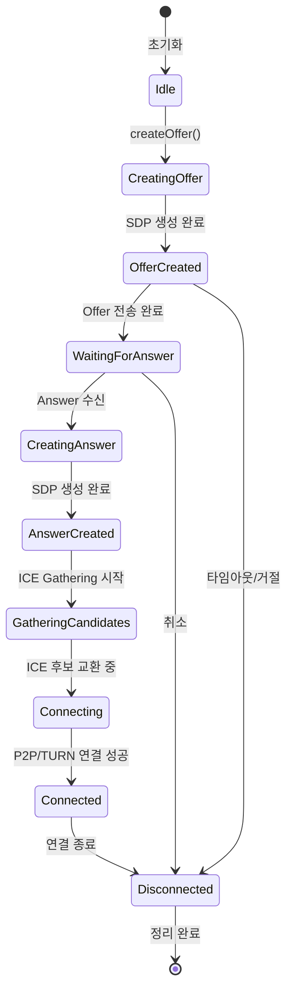

### 의존성 주입 (Hilt)

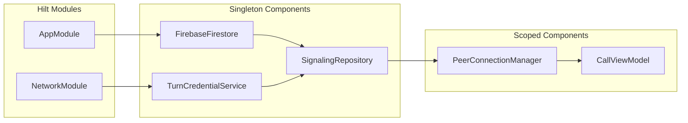

### 비동기 처리 (Coroutines + Flow)

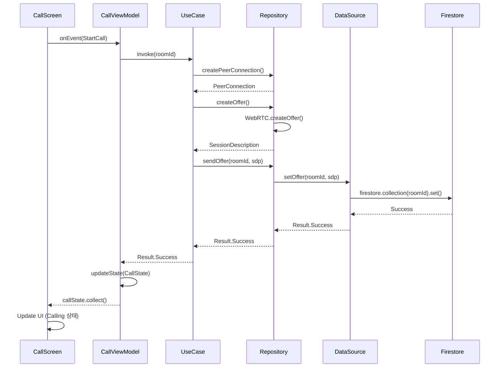

### 보안 계층

| 컴포넌트 | 기술 | 용도 |
|---------|------|------|
| Firewall | iptables | 패킷 필터링 |
| DDoS Protection | fail2ban | 무차별 대입 방어 |
| Authentication | Firebase Auth | 사용자 인증 |

---

## 네트워크 토폴로지

### Oracle Cloud 네트워크 구성

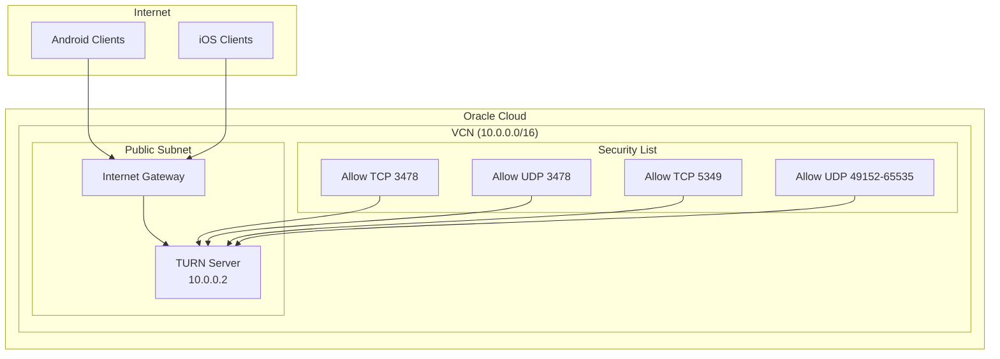

### 포트 매핑

| 포트 | 프로토콜 | 용도 | 설명 |
|------|---------|------|------|
| 3478 | TCP/UDP | STUN/TURN | 기본 STUN/TURN 포트 |
| 3479 | TCP/UDP | STUN/TURN | 대체 포트 |
| 5349 | TCP | TURNS | TLS over TURN |
| 5350 | TCP | TURNS | TLS 대체 포트 |
| 49152-65535 | UDP | Media Relay | TURN 릴레이 포트 범위 |

---

## 모니터링 및 로깅

### 모니터링 아키텍처

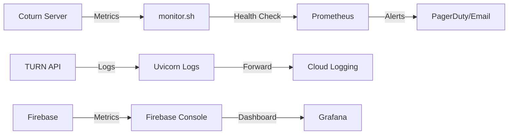

### 로그 수집

1. **Coturn 로그**: `/var/log/turnserver.log`
2. **API 로그**: Uvicorn stdout → Cloud Logging
3. **Firebase 로그**: Firestore 쿼리 로그
4. **시스템 로그**: `/var/log/syslog`

---

## 데이터 모델

### WebRTC 세션 상태 머신

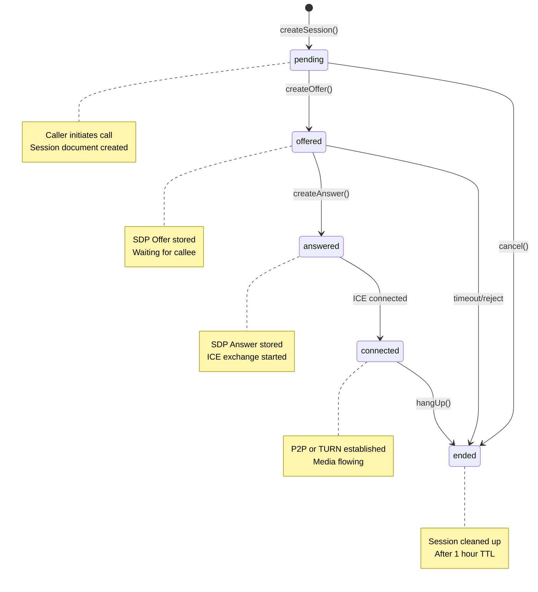

---

## 성능 최적화

### Oracle Cloud Free Tier 제약 사항

| 리소스 | 제한 | 최적화 전략 |
|--------|------|------------|
| CPU | 1 OCPU | io-thread-count=2, relay-thread-count=2 |
| RAM | 1GB | 최소한의 프로세스 실행 |
| Bandwidth | 10TB/월 | max-bps=3000000 (3Mbps per session) |
| Storage | 200GB | 로그 로테이션, 30일 보관 |

### Firebase Free Tier 제약 사항

| 리소스 | 제한 | 최적화 전략 |
|--------|------|------------|
| Reads | 50K/day | 세션 문서 캐싱 |
| Writes | 20K/day | 배치 업데이트 |
| Storage | 1GB | 1시간 TTL로 자동 삭제 |

---

## 참고 문헌

- [WebRTC Protocols](https://webrtc.org/)
- [Coturn Documentation](https://github.com/coturn/coturn)
- [Firebase Firestore Security Rules](https://firebase.google.com/docs/firestore/security)
- [Oracle Cloud Free Tier](https://www.oracle.com/cloud/free/)

---

**문서 버전**: 1.0.0
**마지막 업데이트**: 2026-01-18
**작성자**: WebRTC-Lite Team
