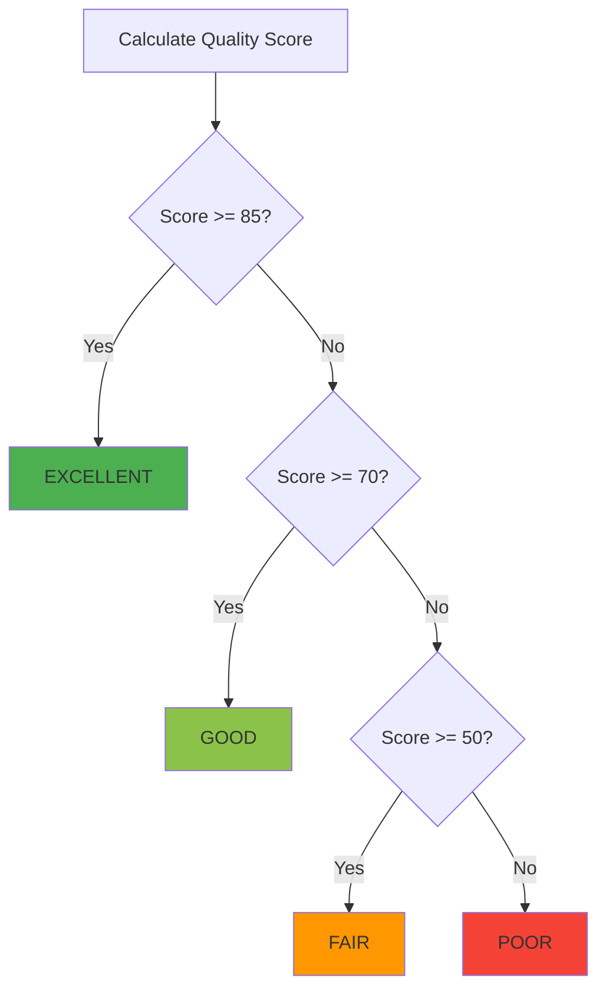

# Quality Metrics Reference

## Overview

이 문서는 WebRTC-Lite의 품질 메트릭 시스템에서 사용되는 모든 메트릭, 계산 방법, 품질 상태의 상세 참조 가이드입니다.

## Quality Score System

### Score Composition

품질 점수는 세 가지 주요 메트릭의 가중 평균으로 계산됩니다:

```
Quality Score = RTT Score (25%) + Packet Loss Score (40%) + Bitrate Score (35%)
```

**최대 점수**: 100점
**최소 점수**: 0점

### Score Ranges

| Score Range | Quality State | Color | User Experience |
|-------------|---------------|-------|-----------------|
| 85-100 | EXCELLENT | Green (#4CAF50) | 완벽한 화질/음질 |
| 70-84 | GOOD | Light Green (#8BC34A) | 양호한 화질/음질 |
| 50-69 | FAIR | Orange (#FF9800) | 약간의 불안정함 |
| 0-49 | POOR | Red (#F44336) | 사용 불가능한 수준 |

## Individual Metrics

### 1. RTT (Round Trip Time)

**정의**: 패킷이 전송되고 응답을 받을 때까지의 시간

**측정 단위**: 밀리초 (ms)

**점수 계산**:

| RTT (ms) | Score | Quality |
|----------|-------|---------|
| < 50 | 25 | Excellent |
| < 100 | 18 | Good |
| < 200 | 10 | Fair |
| >= 200 | 5 | Poor |

**WebRTC Stats API**:
```javascript
// candidate-pair stat
{
  "roundTripTime": 45.2  // seconds → ms 변환 필요
}
```

**최적 값**:
- **Local Network**: < 10ms
- **Same Country**: 20-50ms
- **International**: 100-300ms
- **Satellite**: 500ms+

### 2. Packet Loss

**정의**: 전송된 패킷 중 도착하지 않은 패킷의 비율

**측정 단위**: 퍼센트 (%)

**점수 계산**:

| Packet Loss (%) | Score | Quality |
|-----------------|-------|---------|
| < 1.0 | 40 | Excellent |
| < 3.0 | 30 | Good |
| < 5.0 | 20 | Fair |
| >= 5.0 | 10 | Poor |

**WebRTC Stats API**:
```javascript
// inbound-rtp stat
{
  "packetsReceived": 1500,
  "packetsLost": 15
}

// 계산: (packetsLost / (packetsReceived + packetsLost)) * 100
```

**영향**:
- **< 1%**: 인지할 수 없음
- **1-3%**: 약간의 끊김
- **3-5%**: 명확한 끊김
- **> 5%**: 사용 불가능

### 3. Bitrate

**정의**: 초당 수신/전송되는 데이터의 양

**측정 단위**: 킬로비트 per second (Kbps)

**점수 계산**:

| Bitrate (Kbps) | Score | Quality | Resolution |
|----------------|-------|---------|------------|
| > 1000 | 35 | Excellent | 720p+
| > 500 | 25 | Good | 480p-720p |
| > 250 | 15 | Fair | 360p-480p |
| <= 250 | 5 | Poor | < 360p |

**WebRTC Stats API**:
```javascript
// inbound-rtp stat
{
  "bytesReceived": 150000,
  "bytesReceived": 145000  // 1초 후
}

// 계산: ((current - previous) * 8) / 1000  // Kbps
```

**권장 비트레이트**:

| Resolution | FPS | Video Bitrate | Audio Bitrate |
|------------|-----|---------------|---------------|
| 180p | 15-30 | 150-200 Kbps | 32-64 Kbps |
| 360p | 24-30 | 400-800 Kbps | 32-64 Kbps |
| 480p | 24-30 | 800-1200 Kbps | 32-64 Kbps |
| 720p | 24-30 | 1500-2500 Kbps | 32-64 Kbps |
| 1080p | 24-30 | 2500-4000 Kbps | 32-64 Kbps |

## Quality State Decision Tree



## Color Coding

### Hex Values

| State | Color | Hex | RGB |
|-------|-------|-----|-----|
| EXCELLENT | Green | #4CAF50 | 76, 175, 80 |
| GOOD | Light Green | #8BC34A | 139, 195, 74 |
| FAIR | Orange | #FF9800 | 255, 152, 0 |
| POOR | Red | #F44336 | 244, 67, 54 |

### Android (Compose)

```kotlin
fun getQualityColor(score: Int): Color {
    return when {
        score >= 85 -> Color(0xFF4CAF50.toInt())  // Green
        score >= 70 -> Color(0xFF8BC34A.toInt())  // Light Green
        score >= 50 -> Color(0xFFFF9800.toInt())  // Orange
        else -> Color(0xFFF44336.toInt())         // Red
    }
}
```

### iOS (SwiftUI)

```swift
func getQualityColor(score: Int) -> Color {
    switch score {
    case 85...100:
        return Color(red: 0.3, green: 0.69, blue: 0.31)  // Green
    case 70...84:
        return Color(red: 0.55, green: 0.76, blue: 0.29) // Light Green
    case 50...69:
        return Color(red: 1.0, green: 0.6, blue: 0.0)    // Orange
    default:
        return Color(red: 0.96, green: 0.26, blue: 0.21) // Red
    }
}
```

## Metric Collection Frequency

### Recommended Intervals

| Use Case | Interval | Reason |
|----------|----------|--------|
| Real-time monitoring | 1 second | 즉각적인 피드백 |
| Battery optimization | 3-5 seconds | 배터리 절약 |
| Analytics | 10-30 seconds | 트렌드 분석 |
| Debugging | 500ms | 상세 정보 |

### Performance Impact

| Interval | CPU Usage | Battery Impact |
|----------|-----------|----------------|
| 500ms | ~5% | ~2% / hour |
| 1s | ~3% | ~1% / hour |
| 3s | ~1% | ~0.5% / hour |
| 5s | ~0.5% | ~0.2% / hour |

## Additional Metrics

### Jitter (Buffer)

**정의**: 패킷 도착 시간의 변동성

**WebRTC Stats API**:
```javascript
// inbound-rtp stat
{
  "jitter": 0.015  // seconds
}
```

**권장 값**: < 30ms (Good), < 50ms (Acceptable)

### Resolution (Video)

**정의**: 비디오 프레임의 해상도

**WebRTC Stats API**:
```javascript
// inbound-rtp stat (video)
{
  "frameWidth": 1280,
  "frameHeight": 720
}
```

**일반 해상도**:
- SD (480p): 640x480
- HD (720p): 1280x720
- Full HD (1080p): 1920x1080
- 4K: 3840x2160

### Frame Rate

**정의**: 초당 전송되는 프레임 수

**WebRTC Stats API**:
```javascript
// inbound-rtp stat (video)
{
  "framesPerSecond": 24.5
}
```

**권장 값**:
- 최소: 15 FPS (부자연스러움)
- 양호: 24-30 FPS (자연스러움)
- 최적: 60 FPS (매우 부드러움)

## Alert Thresholds

### Warning Alerts

| Metric | Threshold | Action |
|--------|-----------|--------|
| RTT | > 100ms | 사용자에게 알림 |
| Packet Loss | > 3% | 연결 불안정 표시 |
| Bitrate | < 500 Kbps | 낮은 화질 알림 |
| Quality Score | < 70 | 품질 저하 경고 |

### Critical Alerts

| Metric | Threshold | Action |
|--------|-----------|--------|
| RTT | > 200ms | 심각한 지연 경고 |
| Packet Loss | > 5% | 재연결 고려 |
| Bitrate | < 250 Kbps | 화질 최소화 경고 |
| Quality Score | < 50 | 연결 불안정 심각 |

## Usage Examples

### Android

```kotlin
// 현재 품질 메트릭 가져오기
val metrics = rtcStatsCollector.metrics.value

when (metrics.qualityState) {
    QualityState.EXCELLENT -> {
        // 최적 상태
        showQualityIndicator(Color.Green)
    }
    QualityState.GOOD -> {
        // 양호한 상태
        showQualityIndicator(Color(0xFF8BC34A.toInt()))
    }
    QualityState.FAIR -> {
        // 보통 상태 - 사용자에게 알림
        showQualityIndicator(Color.Orange)
        showToast("Connection quality is fair")
    }
    QualityState.POOR -> {
        // 나쁜 상태 - 경고 표시
        showQualityIndicator(Color.Red)
        showAlert("Poor connection quality. Please check your network.")
    }
}
```

### iOS

```swift
// 현재 품질 메트릭 가져오기
let metrics = rtcStatsCollector.metrics

switch metrics.qualityState {
case .excellent:
    // 최적 상태
    showQualityIndicator(.green)
case .good:
    // 양호한 상태
    showQualityIndicator(Color(red: 0.55, green: 0.76, blue: 0.29))
case .fair:
    // 보통 상태
    showQualityIndicator(.orange)
    showToast("Connection quality is fair")
case .poor:
    // 나쁜 상태
    showQualityIndicator(.red)
    showAlert("Poor connection quality. Please check your network.")
}
```

## Best Practices

1. **주기적인 모니터링**: 1초 간격으로 메트릭 수집
2. **UI 피드백**: 품질 저하 시 사용자에게 시각적 피드백
3. **적응형 품질**: 네트워크 상태에 따라 비디오 품질 조정
4. **로그 기록**: 품질 트렌드 분석을 위해 메트릭 기록
5. **사용자 통제**: 품질 표시를 켜고 끌 수 있는 옵션 제공

## Troubleshooting

### 낮은 품질 점수

**원인**:
- 느린 네트워크 연결
- 높은 패킷 손실
- 낮은 비트레이트

**해결**:
1. 네트워크 연결 확인
2. WiFi로 전환 (가능한 경우)
3. 비디오 해상도 낮추기
4. TURN 서버 확인

### 품질 점수가 업데이트되지 않음

**원인**:
- RTCStatsCollector가 시작되지 않음
- PeerConnection이 연결되지 않음

**해결**:
1. `rtcStatsCollector.start()` 호출 확인
2. PeerConnection 상태 확인
3. 수집 간격 확인

---

**버전**: 1.0.0
**마지막 업데이트**: 2026-01-19
